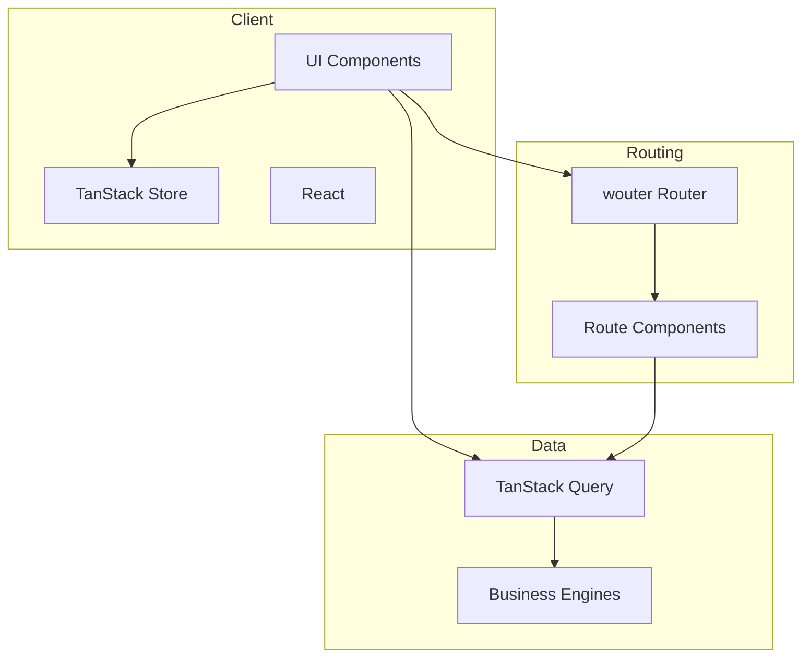

# ARCHITECTURE.md — Project Map

## Tech Stack Overview
- **Routing**: wouter 3.x (committed; pattern-based, lightweight, no loaders)
- **Server State**: TanStack Query (async data fetching, caching)
- **Client State**: TanStack Store (simple client-side state)
- **UI**: shadcn/ui components with Tailwind CSS v4

## Entry Points
- **Main**: `src/main.tsx` — Application bootstrap
- **Router**: `src/router.tsx` — Route definitions

## Directory Structure
```
src/
├── main.tsx              # Entry point
├── router.tsx            # Route definitions
├── index.css             # Design tokens + Tailwind v4
├── components/
│   ├── ui/              # shadcn/ui primitives + factory.ai pattern components
│   │                    #   (step-counter, stat-display, section-label,
│   │                    #    NumberedTabsList/Trigger in tabs.tsx)
│   ├── layout/          # Layout shell
│   └── showcase/        # Component dev sandbox (temporary)
├── store/
│   └── learnerStore.ts  # Client state (TanStack Store)
├── lib/
│   ├── engines/         # Business logic (FSRS, mastery, XP, session, interleaving,
│   │                    #   remediation, diagnostic, FIRe, recommendations, exportImport)
│   ├── hooks/           # Custom React hooks (use-dashboard-stats, useLocalStorage, etc.)
│   ├── storage/         # IndexedDB + hybrid storage adapter
│   ├── content.ts       # TanStack Query hooks for /content/*.json
│   ├── validation.ts    # Zod content validation
│   ├── logger.ts        # Dev logging
│   └── utils.ts         # Utilities (cn(), etc.)
└── types/
    └── index.ts         # Shared TypeScript types
```

## Data Flow

### Mermaid Diagram


### Text Description

1. **User Interaction** → UI Component receives input
2. **Routing** → wouter determines which route component to render
3. **State** →
   - TanStack Query handles async data (caching, invalidation)
   - TanStack Store handles client state (learner progress, UI state)
4. **Engines** → Pure business logic (FSRS scheduling, XP, mastery, recommendations)
5. **Rendering** → React updates UI based on state changes

## Key Patterns

### Component Composition
```
Page → Layout → Components → UI Primitives (shadcn)
```

### State Management
- **Server Data**: Use TanStack Query hooks (`useQuery`, `useMutation`)
- **Client UI State**: Use TanStack Store or local `useState`
- **Form State**: Use React Hook Form + Zod validation

## External Dependencies
- No backend API configured yet (placeholder for future integration)
- Fonts: Montserrat (sans), Merriweather (serif), Source Code Pro (mono) via @fontsource
