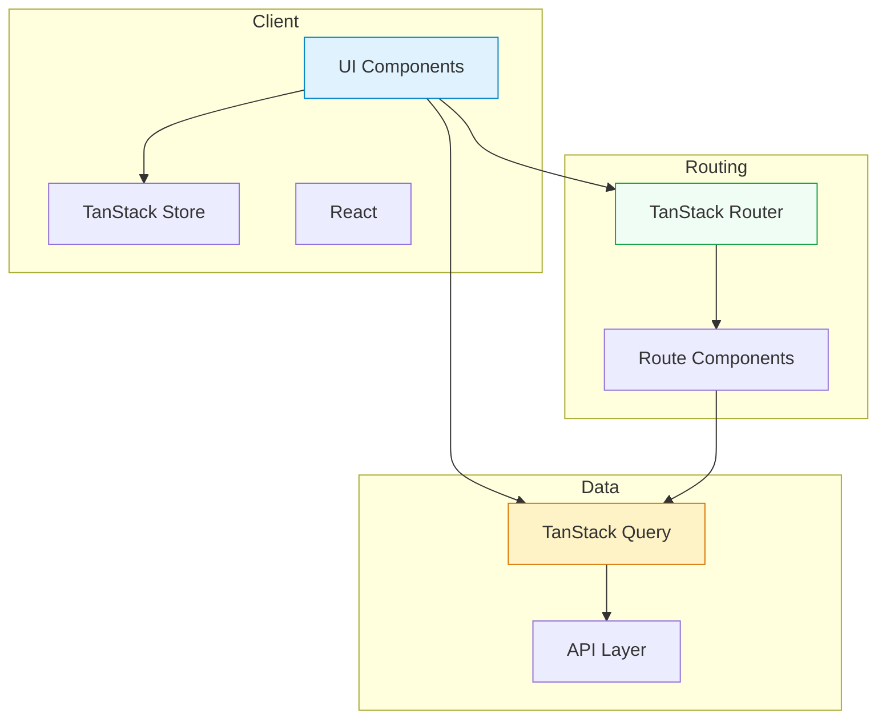

# ARCHITECTURE.md — Project Map

## Tech Stack Overview
- **Routing**: TanStack Router (file-based, declarative)
- **Server State**: TanStack Query (async data fetching, caching)
- **Client State**: TanStack Store (simple client-side state)
- **UI**: Custom components with Tailwind CSS v4

## Entry Points
- **Main**: `src/main.tsx` — Application bootstrap
- **Router**: `src/router.tsx` — Route definitions

## Directory Structure
```
src/
├── main.tsx              # Entry point
├── router.tsx            # TanStack Router config
├── App.tsx               # Root component
├── components/
│   ├── ui/              # Base UI primitives
│   └── [feature]/       # Feature-specific components
├── routes/
│   └── [route].tsx      # Page routes (TanStack Router)
├── lib/
│   ├── utils.ts         # Utilities (cn(), etc.)
│   └── [feature].ts    # Feature utilities
├── hooks/               # Custom React hooks
└── styles/
    └── globals.css      # Global styles + Tailwind
```

## Data Flow

### Mermaid Diagram


### Text Description

1. **User Interaction** → UI Component receives input
2. **Routing** → TanStack Router determines which route component to render
3. **State** → 
   - TanStack Query handles async data (API calls, caching)
   - TanStack Store handles client state (UI state, form state)
4. **Rendering** → React updates UI based on state changes

## Key Patterns

### Route Definition
```typescript
// routes/index.tsx
export const route = createFileRoute('/')({
  component: Index,
})

function Index() {
  return <div>Hello</div>
}
```

### Component Composition
```
Page → Layout → Components → UI Primitives
```

### State Management
- **Server Data**: Use TanStack Query hooks (`useQuery`, `useMutation`)
- **Client UI State**: Use TanStack Store or local useState
- **Form State**: Use React Hook Form + Zod validation

## External Dependencies
- No backend API configured yet (placeholder for future integration)
- Fonts: Merriweather, Montserrat, Source Code Pro (via @fontsource)
