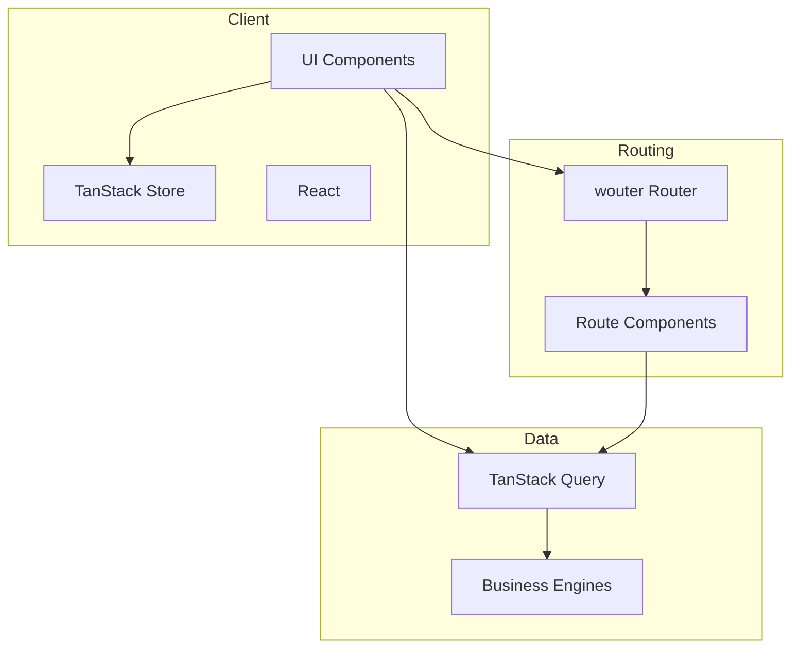

# ARCHITECTURE.md — Project Map

## Tech Stack Overview
- **Routing**: wouter 3.x (committed; pattern-based, lightweight, no loaders)
- **Server State**: TanStack Query (async data fetching, caching)
- **Client State**: TanStack Store (simple client-side state)
- **UI**: shadcn/ui components with Tailwind CSS v4

## Entry Points
- **Main**: `src/main.tsx` — Application bootstrap
- **Router**: `src/router.tsx` — Route definitions

## Directory Structure
```
src/
├── main.tsx              # Entry point
├── router.tsx            # Route definitions  (/  /session  /session/:topicId)
├── index.css             # Design tokens + Tailwind v4
├── pages/
│   └── session.tsx      # Session screen — answering + feedback phases
├── components/
│   ├── ui/              # shadcn/ui primitives + factory.ai pattern components (incl. skeleton)
│   │                    #   (step-counter, stat-display, section-label,
│   │                    #    NumberedTabsList/Trigger in tabs.tsx)
│   ├── session/         # Session complete summary (wireframe 11)
│   ├── layout/          # Layout shell
│   └── showcase/        # Component dev sandbox (temporary)
├── store/
│   └── learnerStore.ts  # Client state (TanStack Store)
├── lib/
│   ├── engines/         # Business logic (FSRS, mastery, XP, session, interleaving,
│   │                    #   remediation, diagnostic, FIRe, recommendations, exportImport)
│   ├── hooks/           # Custom React hooks (use-dashboard-stats, useLocalStorage, etc.)
│   ├── storage/         # IndexedDB + hybrid storage adapter
│   ├── session-complete-aggregates.ts  # Pure helpers for session end (duration, due dates, weak tags)
│   ├── content.ts       # TanStack Query hooks for /content/*.json
│   ├── validation.ts    # Zod content validation
│   ├── logger.ts        # Dev logging
│   └── utils.ts         # Utilities (cn(), etc.)
└── types/
    └── index.ts         # Shared TypeScript types
```

**Documentation (`docs/`):**
- `wireframes/` — screen specs
- `audits/` — UX / interface audit reports (e.g. session screen); optional copies or summaries of ux-audit runs
- Root-level `docs/ux-audit-*.md`, `docs/qa-sweep-*.md`, etc. — structured reports from the **ux-audit** skill (see `.agents/skills/ux-audit/SKILL.md`)
- `archives/stale-storybook-ui-docs-2026-03/` — archived Storybook-era UI docs (not shipped; see `README.md` there). Active workflow: `WORKFLOW.md` + `npm run dev`.

**Agent tooling (repo root, not under `src/`):**
- `.agents/skills/` — AI skills installed via `npx skills add …`: `ux-copy`, `ux-audit`, `grill-me`, `self-improvement`, `agent-browser`, `dogfood`, `electron`. [OpenCode](https://opencode.ai/docs/skills) loads `skills/*/SKILL.md` from here via the skill tool; `opencode.json` also injects `AGENTS.md` plus `docs/*` context files. Locked versions: `skills-lock.json`.
- `.learnings/` — Agent/human learning logs (`LEARNINGS.md`, `ERRORS.md`, `FEATURE_REQUESTS.md`); see `AGENTS.md` (Self-improvement)
- `.cursor/rules/` — Cursor project rules (e.g. `ux-copy.mdc`, `ux-audit.mdc`, `dogfood.mdc`, `grill-me-strategy.mdc`)

## Data Flow

### Mermaid Diagram


### Text Description

1. **User Interaction** → UI Component receives input
2. **Routing** → wouter determines which route component to render
3. **State** →
   - TanStack Query handles async data (caching, invalidation)
   - TanStack Store handles client state (`learnerStore`: `LearnerState` — XP, streak, `streakGoalDays`, topics, FSRS cards, review logs; persisted to localStorage)
4. **Engines** → Pure business logic (FSRS scheduling, XP, mastery, recommendations)
5. **Rendering** → React updates UI based on state changes

## Key Patterns

### Component Composition
```
Page → Layout → Components → UI Primitives (shadcn)
```

### State Management
- **Server Data**: Use TanStack Query hooks (`useQuery`, `useMutation`)
- **Client UI State**: Use TanStack Store or local `useState`
- **Form State**: Use React Hook Form + Zod validation

## External Dependencies
- No backend API configured yet (placeholder for future integration)
- Fonts: Montserrat (sans), Merriweather (serif), Source Code Pro (mono) via @fontsource
- **Future**: optional **opt-in study** event pipeline (assignment/analysis) per [docs/strategy/product-strategy.md](strategy/product-strategy.md)—add data-flow here when implemented
