# JadiMikir: Product Management Analysis
**Product**: JadiMikir Adaptive MCQ Learning Platform  
**Document Type**: Strategic PM Review — Problems, Analysis, Recommendations  
**Date**: 2026-03-29  
**Version**: 1.0

---

## Table of Contents

1. [Executive Overview](#1-executive-overview)
2. [Problem Mapping](#2-problem-mapping)
3. [Root Cause Analysis](#3-root-cause-analysis)
4. [Principle Violations by PM Domain](#4-principle-violations-by-pm-domain)
5. [Strengths Inventory](#5-strengths-inventory)
6. [Recommendations](#6-recommendations)
7. [PM Exercises & Practices Needed](#7-pm-exercises--practices-needed)
8. [Prioritized Action Plan](#8-prioritized-action-plan)

---

## 1. Executive Overview

JadiMikir has a technically rigorous core — FSRS scheduling, local-first architecture, outcome-first metrics, and a thoughtfully sequenced roadmap. The product strategy reflects strong inward-facing thinking: the engine design, measurement architecture, and privacy commitments are ahead of what most early-stage products achieve.

However, the strategy has a structural imbalance: **the outward-facing work — persona validation, assumption testing, go-to-market clarity — has been systematically deferred or substituted with architectural decisions.** The brainstorming analysis compounds this by resolving strategic tensions with a single UI pattern (educational tooltips) rather than making hard product choices.

The risk is not that the product is poorly designed. It's that a well-designed product may be solving problems that haven't been confirmed to exist in the target market, for users whose precise profile remains ambiguous.

---

## 2. Problem Mapping

### 2.1 Problem Inventory

| # | Problem | Domain | Severity | Type |
|---|---------|--------|----------|------|
| P1 | No validated persona split between high-agency and casual learners | Strategy | 🔴 Critical | Assumption gap |
| P2 | Solutions defined before problems are stated in user terms | Process | 🔴 Critical | Anti-pattern |
| P3 | Content bottleneck has no concrete mitigation until Phase 3 | Roadmap | 🔴 Critical | Dependency gap |
| P4 | Phase success criteria are functional checks, not learning goals | Metrics | 🟠 High | Measurement gap |
| P5 | UGC deferred without resolving architectural conflict with local-first | Architecture | 🟠 High | False optionality |
| P6 | No competitive usage testing — complexity barriers asserted, not observed | Validation | 🟠 High | Evidence gap |
| P7 | Learning lab (measurement pipeline) comes after the most critical validation window | Sequencing | 🟠 High | Instrumentation gap |
| P8 | Privacy pitch unvalidated for Indonesian market context | Market fit | 🟡 Medium | Assumption gap |
| P9 | "Educational tooltips" used as a strategic resolution, not a UI affordance | Brainstorming | 🟡 Medium | Anti-pattern |
| P10 | Structured vs. unstructured content model deferred without architectural pre-commitment | Architecture | 🟡 Medium | Decision debt |

---

### 2.2 Problem Relationship Map

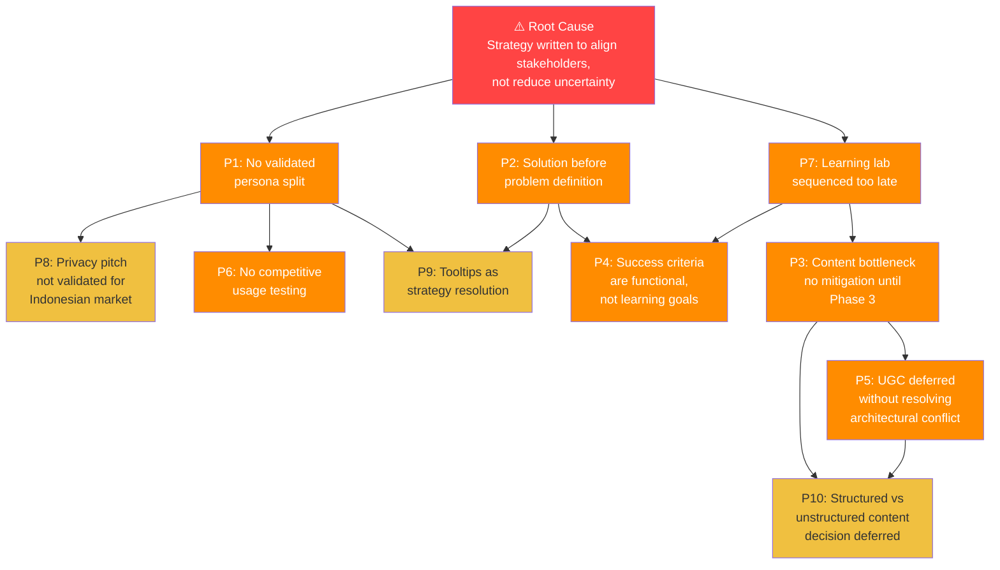

---

### 2.3 Impact vs. Effort to Resolve

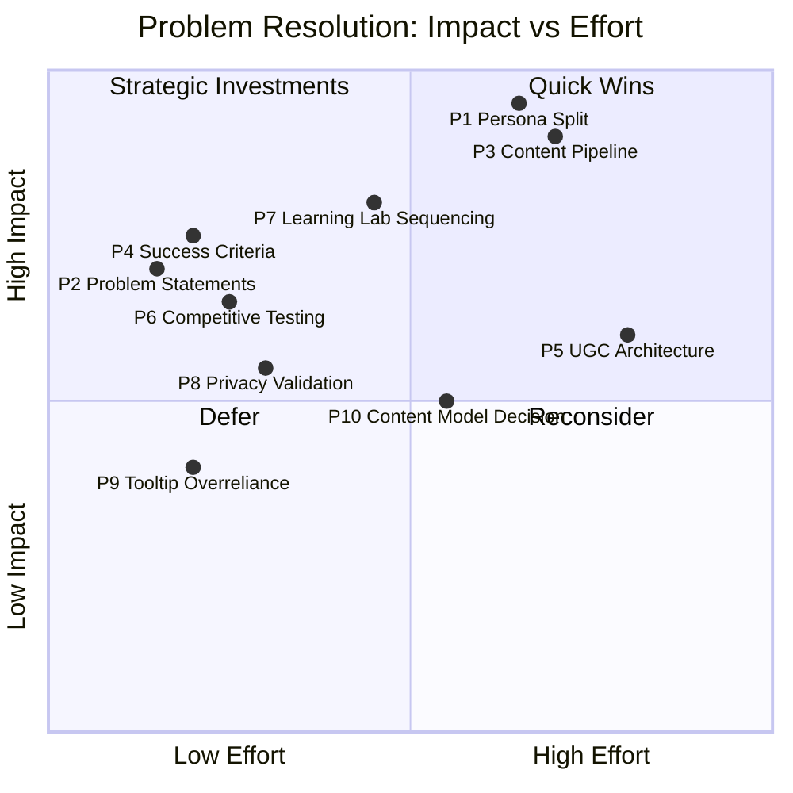

---

## 3. Root Cause Analysis

### 3.1 The Core Pattern

All ten problems trace back to a single meta-failure: **the strategy was written to confirm a direction rather than to stress-test assumptions.**

This is identifiable by three structural signals in the document:

1. **Tension → Resolution pattern**: Every strategic tension (persona complexity, content model ambiguity, UGC architecture conflict) is resolved through synthesis rather than left as an open question requiring evidence.

2. **Risk table disconnected from roadmap**: High-impact risks (content bottleneck) are correctly identified in the risk section but do not appear as mitigations in the roadmap timeline.

3. **Phases as delivery milestones, not learning milestones**: Each phase ends when features ship, not when a hypothesis is confirmed or rejected.

### 3.2 Founder Pattern Recognition

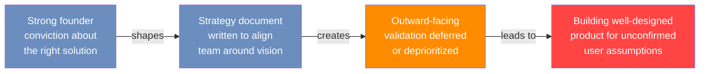

This is not a failure of capability — it's a common pattern in technically strong founders. The corrective is not to rebuild the strategy but to add a validation layer alongside the existing roadmap.

---

## 4. Principle Violations by PM Domain

### 4.1 Discovery & User Research

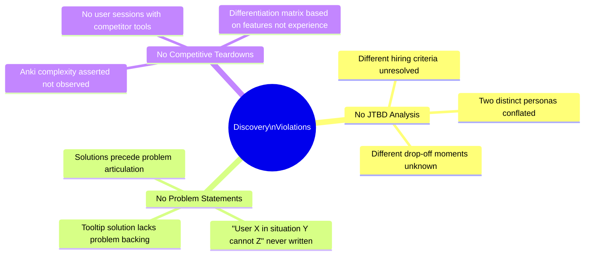

**Principle violated**: *Fall in love with the problem, not the solution.*  
Classic Clayton Christensen / JTBD: before defining what you build, define what job users are hiring the product to do — and whether two user types are hiring it for the same job.

---

### 4.2 Roadmap & Prioritization

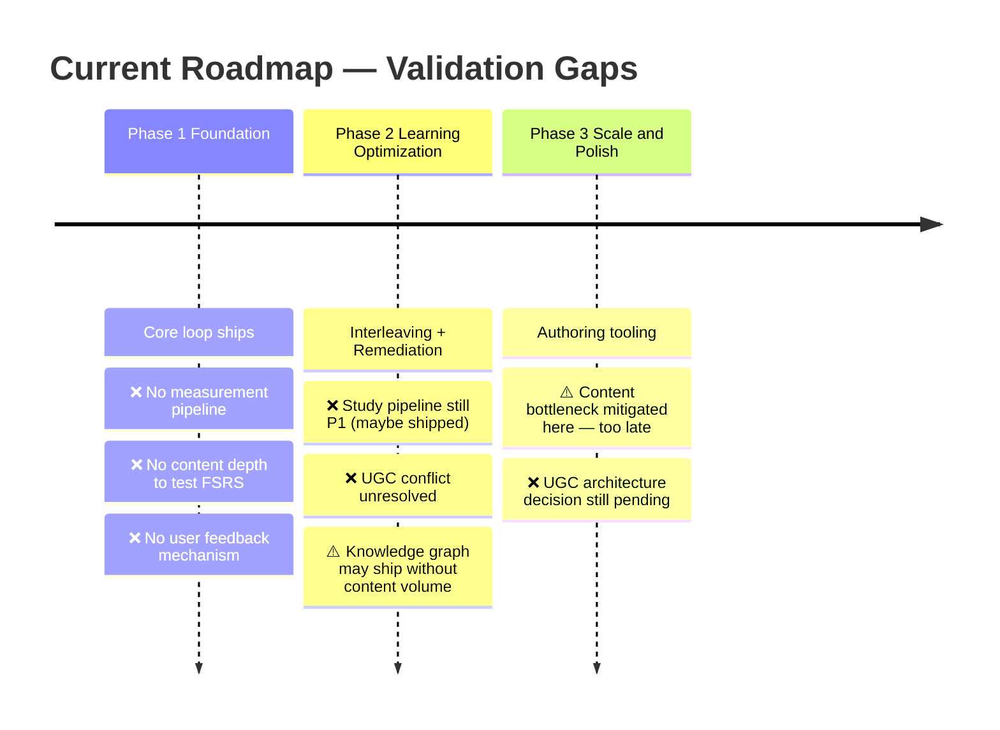

**Principle violated**: *Risks should be sequenced inverse to their impact.* High-impact risks (content, measurement, persona) should be resolved earliest, not latest. The current sequencing optimizes for feature completeness, not risk reduction.

---

### 4.3 Metrics & Measurement

| What Exists | What's Missing | PM Principle Violated |
|---|---|---|
| Outcome-first metric hierarchy ✅ | Baseline measurements at launch ❌ | You can't improve what you can't measure from day one |
| 30-day retention target ✅ | Mechanism to measure it in Phase 1 ❌ | Measurement infrastructure must precede the behavior being measured |
| Mastery rate target ✅ | Falsifiable hypothesis attached to it ❌ | Targets without hypotheses are wishes |
| Engagement metrics defined ✅ | Causality between engagement and outcomes ❌ | Correlation ≠ learning effectiveness |

**Principle violated**: *Instrument before you scale, not after.*  
Even if data stays local (on-device aggregates), a minimal instrumentation layer in Phase 1 would tell you whether FSRS is functioning as intended before you build 3 more phases on top of it.

---

### 4.4 Lean & Hypothesis-Driven Development

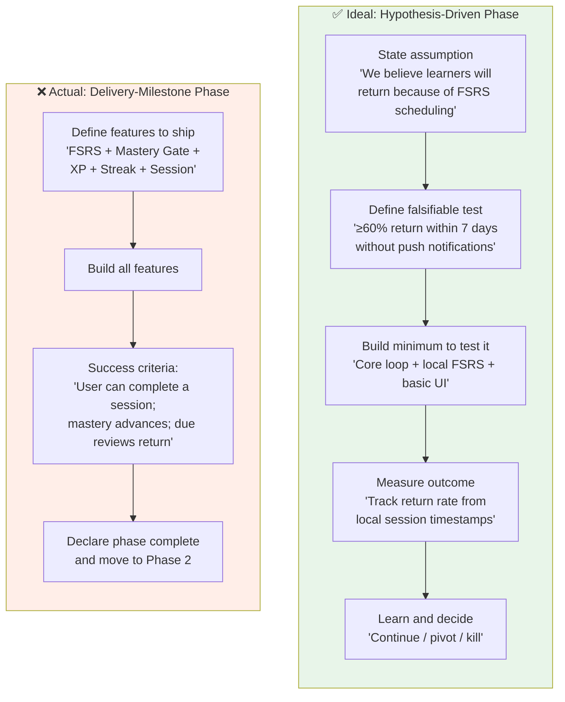

**Principle violated**: *Phases should be learning milestones, not delivery milestones.*  
Each phase should end with: "We now know X, which means we should/shouldn't do Y."

---

### 4.5 Risk Management

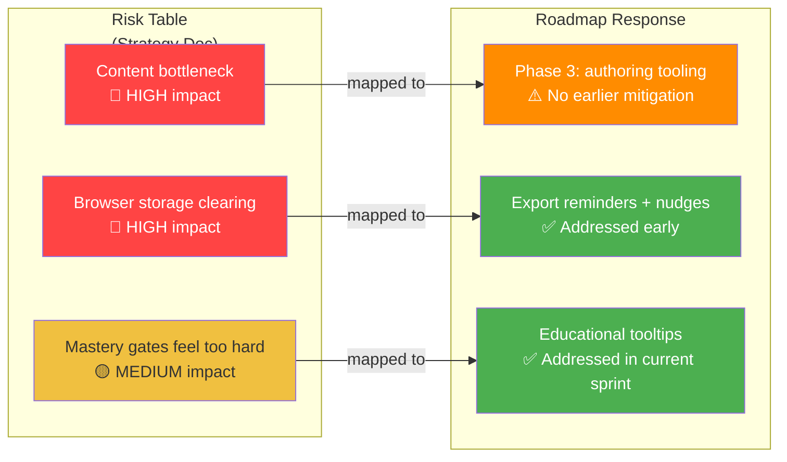

**Principle violated**: *Risk priority should determine roadmap sequencing.*  
The highest-impact risk (content bottleneck) has the latest mitigation. The medium-impact risk (mastery gate confusion) is being addressed first. The roadmap is sequenced by feature readiness, not risk reduction.

---

## 5. Strengths Inventory

These are genuine PM strengths — not common at this stage.

```
 PM Maturity Assessment (0-10)
═══════════════════════════════

 Strengths ▲              Gaps ▼
 ─────────────────────    ─────────────────────
 Learning science rigor   9 │ User validation     2
 Outcome-first metrics    9 │ Assumption testing   2
 Privacy architecture     8 │ Persona definition   3
 Scope exclusions         8 │ Content strategy     3
 Dependency ordering      8 │ Go-to-market clarity 3
 Experimentation design   8 │
 Risk identification      7 │
 ─────────────────────    ─────────────────────
 ████░░░░░░ 2             ██████████ 10
```

| Dimension | Score | Bar |
|---|---|---|
| **Strengths** | | |
| Learning science rigor | 9 | `█████████░` |
| Outcome-first metrics | 9 | `█████████░` |
| Privacy architecture | 8 | `████████░░` |
| Scope exclusions | 8 | `████████░░` |
| Dependency ordering | 8 | `████████░░` |
| Experimentation design | 8 | `████████░░` |
| Risk identification | 7 | `███████░░░` |
| **Gaps** | | |
| User validation | 2 | `██░░░░░░░░` |
| Assumption testing | 2 | `██░░░░░░░░` |
| Persona definition | 3 | `███░░░░░░░` |
| Content strategy | 3 | `███░░░░░░░` |
| Go-to-market clarity | 3 | `███░░░░░░░` |

### Standout Strengths

**Outcome-first metrics hierarchy** is rare and correct. Placing mastery rate and 30-day retention above DAU reflects deep understanding of what "working" means for a learning product. Most early-stage products invert this.

**Privacy as architecture, not marketing** — local-first with specific implementation details (IndexedDB, no-upload default, per-study opt-in) is a real constraint shaping decisions, not a values sticker.

**Learning lab design** — opt-in enrollment, stable anonymous IDs, outcome-first analysis — is forward-thinking. Most products try to retrofit this at scale and pay heavily for it.

**Bloom's 2-sigma as internal design target** — using learning science as a decision filter rather than marketing copy shows intellectual honesty about what the product aspires to and what it hasn't yet proven.

---

## 6. Recommendations

### 6.1 Immediate (Before Next Sprint)

#### R1: Write Problem Statements for Each Core Idea

For every feature in the current sprint, write the problem statement before writing any spec:

```
User: [specific persona]
Situation: [specific moment in the product]
Cannot: [specific action or outcome]
Because: [specific barrier]
Success looks like: [measurable outcome]
```

This takes 30 minutes per feature and immediately surfaces whether the feature has a confirmed problem it's solving.

#### R2: Decide the Persona Split — Pick One Primary

Run a 1-hour internal session to answer: **who is the primary learner for launch?**

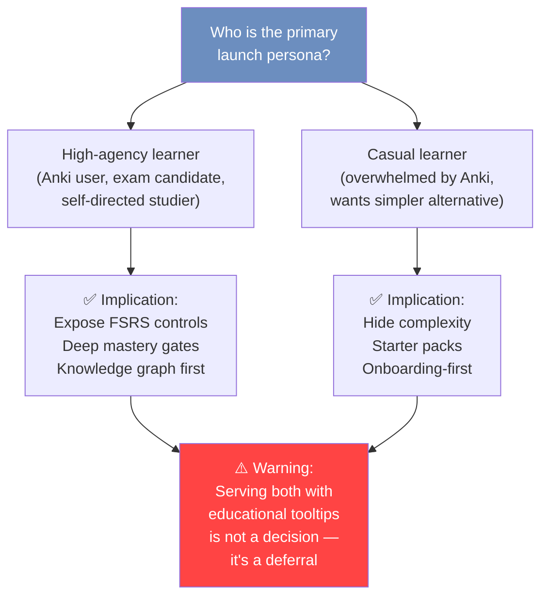

#### R3: Add a Parallel Content Workstream Now

Content is not a Phase 3 feature — it's a Phase 1 prerequisite for FSRS validation. Start immediately in parallel:

- Define 1 subject track (pick the most common Indonesian exam category)
- Write 150–200 questions at SKILL 11 standard
- Establish topic dependency graph for that track
- Use this as the dogfood dataset for all Phase 1–2 testing

---

### 6.2 Before Phase 2 Begins

#### R4: Rewrite Phase Success Criteria as Falsifiable Hypotheses

| Phase | Current Criteria | Rewritten as Hypothesis |
|---|---|---|
| Phase 1 | "User can complete a session; mastery advances" | "≥60% of users who complete one session will return within 7 days without any push notification" |
| Phase 2 | "Mixed sessions, prerequisite drills, bypass known material" | "Users with remediation enabled will show ≥15% higher mastery rate at 30 days vs. users without it" |
| Phase 3 | "Content addable without code; habit formation" | "≥30% of power users (5+ sessions) will attempt to create or import content within 30 days of authoring tool launch" |

#### R5: Minimal On-Device Instrumentation from Day One

Even without the opt-in study pipeline, track locally:

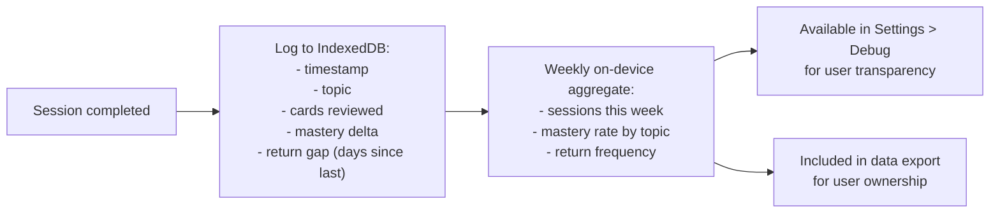

This costs one sprint of engineering, violates no privacy principle, and gives you the ability to reason about whether FSRS is working before Phase 2 ships.

#### R6: Resolve the UGC Architecture Decision

Write a one-page architectural pre-mortem:

> *"If we want UGC sharing in 18 months, which decision made today constrains us most?"*

The answer is likely: **you need at least an optional identity layer** (even pseudonymous) for content attribution and moderation. If you decide you'll never have this, close the UGC door explicitly. If you want it, design the optional identity hook now — it's far cheaper than retrofitting a local-first architecture later.

---

### 6.3 Ongoing Practices

#### R7: Validate the Privacy Pitch for the Indonesian Market

Run 5 user interviews with Indonesian exam candidates. Ask:

1. "What concerns you about using a new study app?"
2. "What would make you trust it?"
3. "If the app stored everything on your device instead of the cloud, what's your reaction?"

Hypothesis to test: *"Local-first is a trust signal for Indonesian learners."*  
Null hypothesis to be prepared for: *"Indonesian learners trust cloud sync more because losing phone = losing progress."*

#### R8: Conduct Competitive Teardown Sessions

Sit with 3 target users and watch them use Anki for 20 minutes. Record:

- Where do they pause?
- What do they skip?
- What do they configure vs. leave default?
- Where do they express confusion or frustration?

This takes one afternoon and will tell you more about the actual complexity barriers than any amount of internal brainstorming about what to put in tooltips.

---

## 7. PM Exercises & Practices Needed

### 7.1 Jobs-to-be-Done Interview Protocol

**What it is**: Structured user interviews focused on the *situation* that causes someone to seek a product, not their feature preferences.

**How to run it for JadiMikir**:

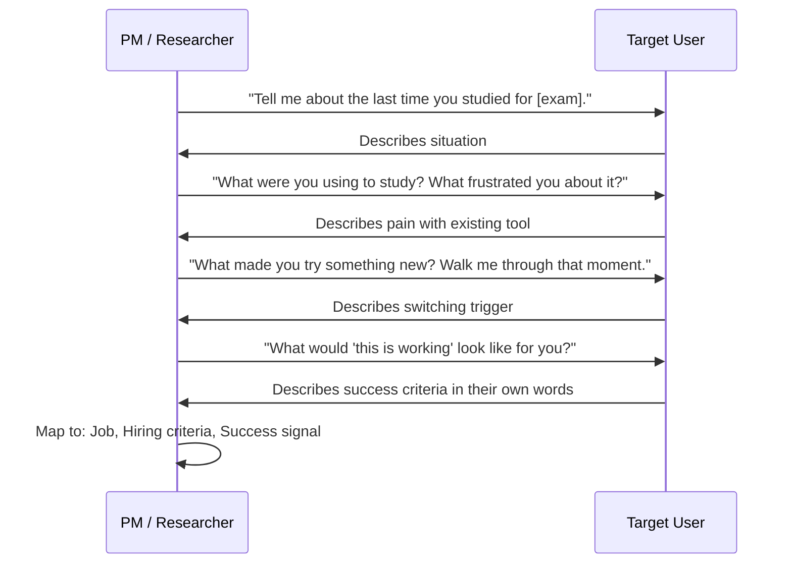

**Target**: 8–10 interviews before Phase 2 begins. Document jobs, not features.

---

### 7.2 Assumption Mapping Exercise

**What it is**: A structured exercise where the team lists every assumption the product strategy makes, then rates each by confidence and impact.

**Template**:

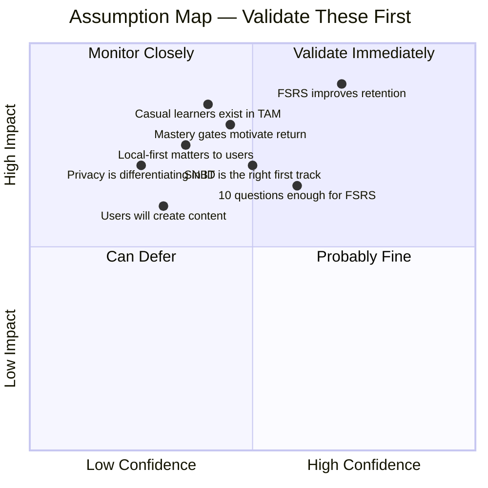

**Run this exercise**: In a 90-minute session, list every "we believe" statement implied by the product strategy. Plot them. The top-left quadrant (low confidence, high impact) is your research roadmap.

---

### 7.3 Sprint Zero: Validate Before You Build

Before the next feature sprint, run one **Sprint Zero**:

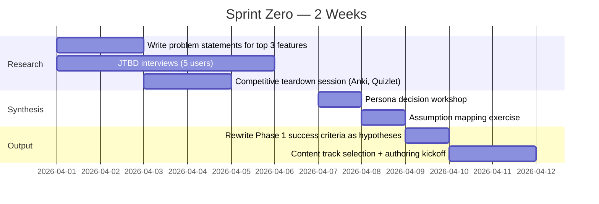

---

### 7.4 Pre-Mortem Exercise

**What it is**: Before shipping a phase, the team imagines it's 6 months later and the phase failed. They write down all the reasons why.

**Run it for Phase 1**:

> *"It's October 2026. Phase 1 shipped but users aren't coming back. What went wrong?"*

Likely answers:
- "There weren't enough questions in any topic to make FSRS feel different from random quizzing"
- "Users didn't understand why topics were locked"
- "The product worked but no one knew it existed"
- "The content was for the wrong exam"

Each answer is a risk that needs a mitigation in the current roadmap.

---

### 7.5 North Star Metric Alignment Exercise

**Current state**: Multiple metrics across three categories with no single north star.

**Exercise**: Align the team around one metric that, if it moves, you're confident the product is working.

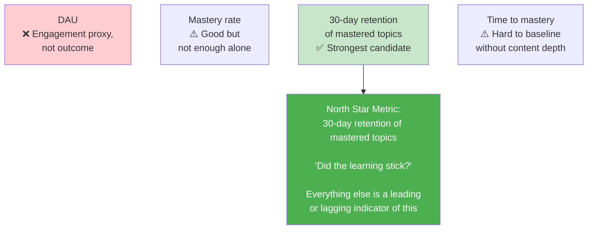

**Why 30-day retention of mastered topics**: It confirms that FSRS is actually working (not just that users answered questions), it requires users to return (engagement), it requires content quality (good questions), and it's the most direct expression of the product's core promise: efficient paths to *durable* mastery.

---

## 8. Prioritized Action Plan

### 8.1 Decision Sequence

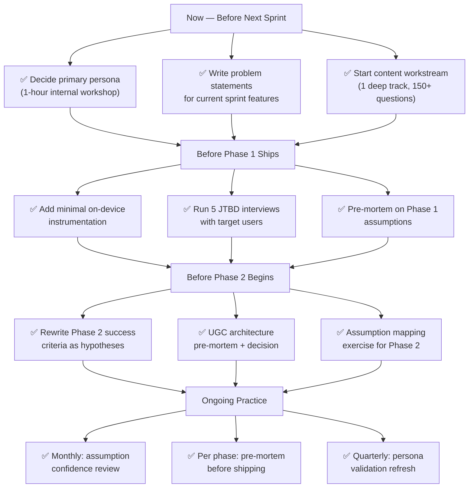

---

### 8.2 Summary Table

| Priority | Action | Owner | Effort | Impact |
|---|---|---|---|---|
| 🔴 P0 | Decide primary persona — workshop | Product lead | 2h | Unblocks all UX decisions |
| 🔴 P0 | Start content track (parallel workstream) | Content + Product | 2 weeks | Unblocks FSRS validation |
| 🔴 P0 | Write problem statements for active features | Product lead | 30min/feature | Prevents solution-first work |
| 🟠 P1 | Rewrite phase success criteria as hypotheses | Product lead | Half day | Enables learning milestones |
| 🟠 P1 | Add minimal on-device instrumentation | Engineering | 1 sprint | Enables Phase 1 feedback loop |
| 🟠 P1 | Run 5 JTBD user interviews | Product lead | 1 week | Validates persona assumptions |
| 🟠 P1 | Competitive teardown sessions (Anki) | Product + Design | 1 afternoon | Grounds complexity claims |
| 🟡 P2 | UGC architecture pre-mortem | Engineering + Product | Half day | Prevents expensive retrofit |
| 🟡 P2 | Assumption mapping exercise | Team | 90 minutes | Surfaces hidden risks |
| 🟡 P2 | Validate privacy pitch with Indonesian users | Product lead | 3 interviews | Confirms/challenges pillar 2 |

---

## Closing Note

The foundation of JadiMikir is strong. The learning science rigor, measurement architecture, and privacy commitment are assets that most early-stage products spend years trying to retrofit. The opportunity cost of the problems identified here is not that the product will fail — it's that a well-built product may spend Phase 1 and Phase 2 learning things that 10 user interviews and one content sprint could have answered in two weeks.

The corrective is not to rebuild the strategy. It is to add a thin validation layer — running alongside the roadmap, not blocking it — that converts the strategy's stated assumptions into confirmed or refuted hypotheses before the team builds three phases deep on top of them.

---

*Analysis based on: `product-strategy.md` (v2.0, 2026-03-28) and `product-strategy-brainstorming-2026-03-29-improved.md`*  
*Generated: 2026-03-29*
