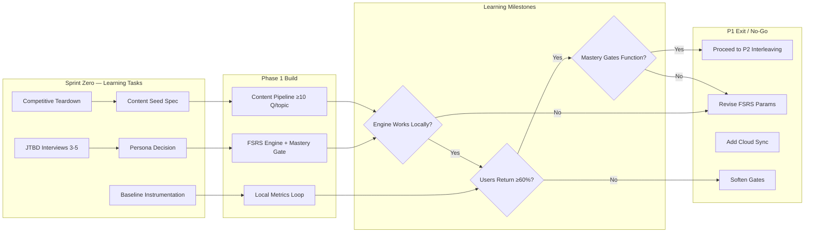
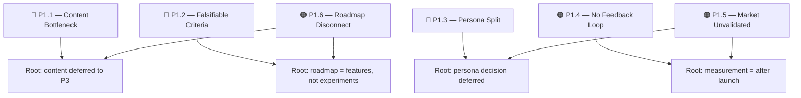
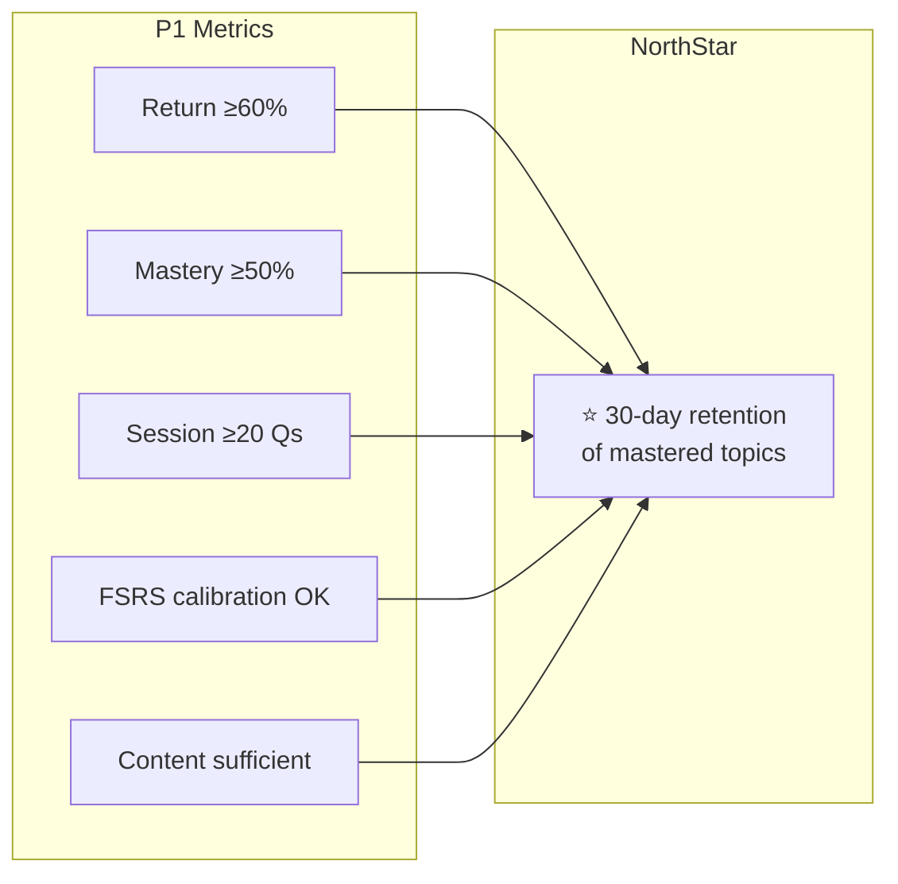

# P1 Problem Definition

> **Document Version:** 1.0
> **Date:** 2026-04-02
> **Scope:** Phase 1 — Foundation (MVP)
> **Preceded by:** [`product-strategy-brainstorming-2026-03-29.md`](../product-strategy-brainstorming-2026-03-29.md), [`jadimikir-pm-analysis.md`](../jadimikir-pm-analysis.md)

---

## 1. Core User Problem

**Self-directed learners preparing for exams** cannot efficiently practice and retain knowledge because generic quiz apps don't adapt to their actual gaps, forcing them into one-size-fits-all sessions that don't reflect real understanding.

Existing alternatives — Quizlet, Khan Academy, Anki — either lack intelligent scheduling, require accounts or institutional overhead, or treat progress as raw scores rather than mastery signals.

**The bet of P1:** If we ship a local-first adaptive MCQ loop with FSRS scheduling, remediation, and visible mastery gates, self-directed learners will *return* because the practice actually feels personalized — not because we push them back.

---

## 2. Problem-to-Workflow Diagram

Each P1 problem maps to a Sprint Zero prerequisite, a Phase 1 build task, a falsifiable milestone, and a go/no-go decision.



---

## 3. Problem Inventory (P1-relevant)

Problems are ranked by severity and ordered by their risk to P1 delivery — not by feature size.

### 🔴 Critical — blockers if unsolved

| ID | Problem | Why it blocks P1 |
|---|---|---|
| **P1.1** | **Content bottleneck treated as Phase 3** | FSRS cannot demonstrate adaptivity with fewer than ~10 distinct questions per topic. The engine is only as good as the item pool feeding it. Content is a P1 prerequisite, not a P3 concern. |
| **P1.2** | **Success criteria are functional, not falsifiable** | "User can complete a session" proves nothing about learning. P1 needs falsifiable hypotheses (e.g., "≥60% return within 7 days without push notifications"; "≥50% of users show mastery progression in their first topic"). |
| **P1.3** | **Persona split unresolved** | High-agency (Anki-style) vs. casual learner is a structural UX fork. Educational tooltips mask a real decision rather than resolving it. Every P1 screen optimizes for two people simultaneously. |

### 🟠 High — serious risk to product-market signal

| ID | Problem | Why it matters for P1 |
|---|---|---|
| **P1.4** | **No instrumentation feedback loop in Phase 1** | "Learning Lab" is sequenced in Phase 2. Without even on-device metrics for mastery, return rate, and FSRS calibration, the core engine is a black box. Local-only instrumentation is not telemetry — it's diagnostic. |
| **P1.5** | **Indonesian market assumption unvalidated** | Strategy assumes "local-first/privacy" is a trust signal. Null hypothesis: Indonesian exam candidates may *prefer* cloud sync to avoid data loss on mobile. This shapes onboarding and retention entirely. |
| **P1.6** | **Risk table and roadmap don't connect** | "Content creation bottleneck" is flagged High Impact in the risk table, but the roadmap places authoring in Phase 3 with no P1 mitigation. The roadmap should reflect risk priority, not feature categories. |

### 🟡 Medium — design and architecture debt

| ID | Problem | Consequence if deferred |
|---|---|---|
| **P1.7** | **Mastery gates may create friction, not motivation** | Without validation, mastery gates could feel punitive rather than progress-oriented. Educational tooltips only help *after* the persona decision (P1.3). |
| **P1.8** | **UGC architecture decision deferred** | Local-first + no-account model conflicts with any future content sharing. Retrofits are expensive. At minimum, document the decision boundary in P1. |

---

## 4. Risk-to-Root-Cause Map



---

## 5. Assumption Log (Top Riskiest)

Assumptions that, if wrong, would invalidate P1. Ranked by (confidence × impact).

| Assumption | Confidence | Impact | How to test in P1 |
|---|---|---|---|
| Learners want adaptive practice, not just more practice | Medium | Critical | JTBD interview: "Tell me about the last time you felt your practice was actually working." |
| FSRS params work for MCQ (not flashcards) | Low-Medium | Critical | Dogfood session logs: compare due-again rate vs. flashcard baseline. |
| Local-first is a trust signal in Indonesia | Low | High | Quick survey/interview: "If you lost your phone with your study data, how would you feel?" |
| One subject track is enough to validate the core loop | High | Medium | Dogfood on single track (e.g. UTBK Math) vs. multi-track early. |
| Users will tolerate mastery gates without feeling blocked | Medium | High | In-product friction measurement: drop-off at mastery gate encounters. |

---

## 6. Learning Milestones — not delivery milestones

Each P1 milestone should end with a falsifiable answer to "we now know X."

| Milestone | We now know… | If yes → | If no → |
|---|---|---|---|
| **Engine works locally** | A single topic with 10+ Qs produces different schedules for different performers | Proceed to interleaving (P2) | Diagnose FSRS params; consider simpler heuristic first |
| **Users return** | ≥60% of dogfood participants return within 7 days without push | Scale content breadth | Diagnose habit formation: gamification, notifications, or content quality |
| **Mastery gates function** | ≥70% of users who hit a gate complete the remediation path | Keep threshold; invest in P2 | Soften gate or add diagnostics before P2 |
| **Local-first is sufficient** | Export usage <5% AND no data-loss complaints in dogfood | Keep local-first architecture | Add cloud sync as P1.5 or P2 P0 |

---

## 7. Success Criteria (falsifiable)

These replace "user can complete a session" as P1 success criteria:

| Criterion | Target | Rationale |
|---|---|---|
| Return rate | ≥60% within 7 days (no push) | Core loop is sticky without coercion |
| Mastery progression | ≥50% of users achieve mastery on ≥1 topic | Engine personalizes; practice leads somewhere |
| Session depth | ≥20 Qs/session (median) | Practice is productive, not trivial |
| FSRS calibration | Due-again rate <15% for "good" responses on second review | Scheduler is working, not just random spacing |
| Content sufficiency | Dogfooders don't report "same questions over and over" | Item pool density meets minimum bar |

---

## 8. North Star Metric Alignment

**North Star:** 30-day retention of mastered topics

All P1 success criteria should map back to this metric. If mastery is achieved but forgotten within 30 days, the engine is not working — and P1 should not proceed to interleaving/remediation until the scheduling baseline is sound.



---

## 9. Immediate Prerequisites (Sprint Zero, ≈2 weeks)

These are *learning* tasks, not engineering tasks. They should be completed before P1 engineering begins:

1. **Persona decision workshop** — pick one primary user (high-agency or casual). All P1 UX decisions flow from this.
2. **Content seed spec** — minimum questions per topic (~10+), target subject choice, and authoring path (manual JSON is acceptable for P1 validation).
3. **Baseline instrumentation spec** — on-device event definitions for mastery, return rate, FSRS calibration. Data stays local; no upload required for P1.
4. **JTBD interviews (3–5)** — validate or falsify the local-first thesis and confirm whether adaptive practice resonates with the primary persona.
5. **Competitive teardown (3 products)** — identify gaps we can exploit that are observable, not assumed (Quizlet, Anki, Khan Academy, or local alternatives).

---

## 10. P1 Artifact Checklist

Minimum artifacts required to enter and exit P1 with confidence:

```mermaid
gantt
    title P1 Artifact Timeline
    dateFormat  W
    axisFormat  Zhou %W

    Sprint Zero          :milestone, sz, 0, 1d
    "Persona Decision"   :after sz, 1w
    "Content Seed Spec"  :after sz, 1w
    "JTBD Interviews"    :after sz, 2w
    "Assumption Log"     :after sz, 1w
    "Competitive Teardown":after sz, 1w

    P1 Build             :milestone, p1, 3, 1d
    "Engine Build"       :after p1, 3w
    "Content Pipeline"   :after p1, 2w
    "Metrics Loop"       :after p1, 2w

    P1 Validate          :milestone, val, 6, 1d
    "Dogfood Sprint"     :after val, 2w
    "Metric Analysis"   :val, 2w

    P1 Exit              :milestone, exit, 8, 1d
```

---

## 11. Related Documents

| Document | Relationship |
|---|---|
| [`product-strategy.md`](../../product-strategy.md) | Source strategy; this document is the P1 decomposition |
| [`jadimikir-pm-analysis.md`](../jadimikir-pm-analysis.md) | PM review findings that informed this problem definition |
| [`critiques_1.md`](../critiques_1.md) | Earlier critique context |
| [CONTEXT.md](../../../CONTEXT.md) | Deferral rules and technical constraints |
