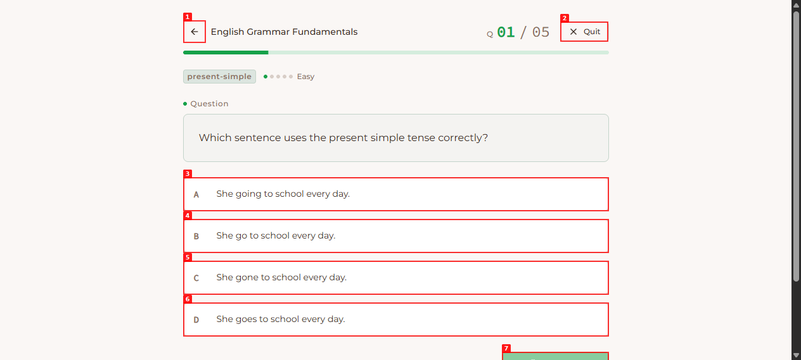
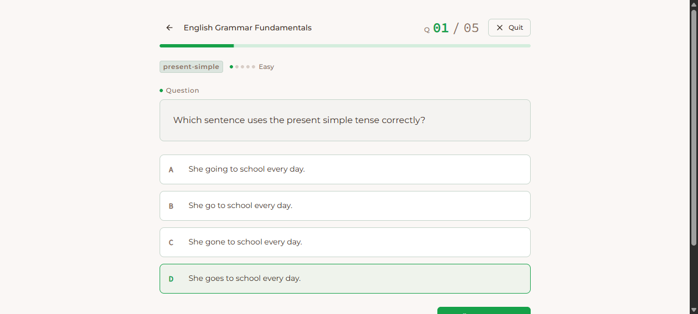
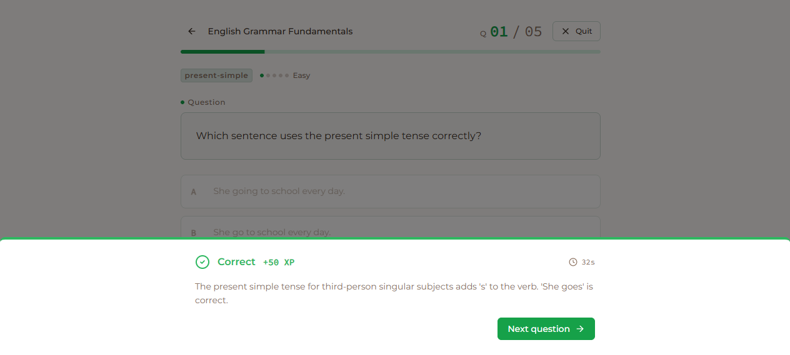
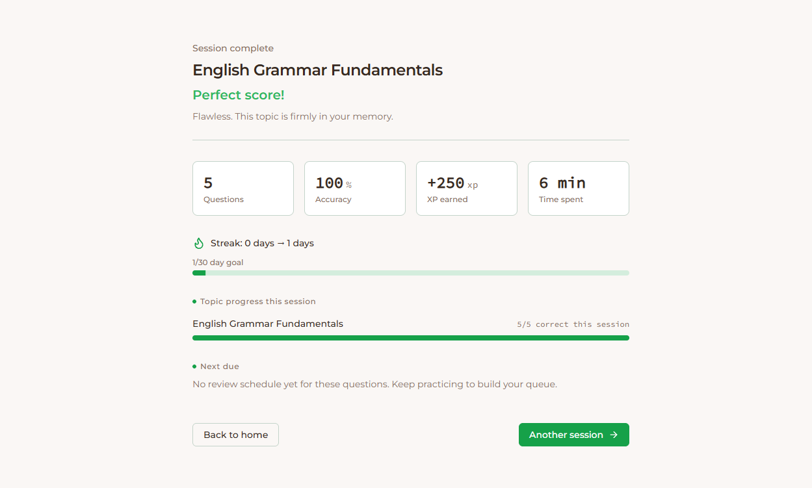

# Dogfood Report: JadiMahir (JadiMikir)

| Field | Value |
|-------|-------|
| **Date** | 2026-03-28 |
| **App URL** | http://localhost:5173 |
| **Session** | jadimahir |
| **Scope** | End-to-end practice session: `english-grammar` (5 questions) through **Session complete** screen |

## Summary

| Severity | Count |
|----------|-------|
| Critical | 0 |
| High | 0 |
| Medium | 1 |
| Low | 0 |
| **Total** | **1** |

**Flow result:** Completed a full 5-question English Grammar session with all answers correct. **Session complete** showed headline copy, “Perfect score!”, stats (5 questions, 100% accuracy, XP, time), streak transition (0 → 1 days), topic progress, **Next due** empty-state copy, and **Back to home** / **Another session** actions. Full-page capture: `screenshots/session-complete-english-grammar.png`.

**Console / errors:** `agent-browser console` and `agent-browser errors` reported no entries after the run.

**Tooling note:** Occasional Windows socket timeout (`os error 10060`) when chaining `wait` + `snapshot` in one shell invocation; running `snapshot` alone succeeded. Not treated as an app defect.

## Issues

### ISSUE-001: First “Confirm answer” click did not open feedback until Confirm was scrolled into view (automation repro)

**Mitigation (2026-03-29):** After a choice is selected, the Confirm row **scrolls into view** (`scrollIntoView`); **`handleConfirm`** uses **`scrollTo({ behavior: 'instant' })`** instead of smooth scroll to reduce races with the feedback sheet. Re-run dogfood if this regresses.

| Field | Value |
|-------|-------|
| **Severity** | medium |
| **Category** | functional / ux |
| **URL** | http://localhost:5173/session/english-grammar |
| **Repro Video** | N/A |

**Description**

After selecting the correct option on question 1, the first click on **Confirm answer** did not reveal the feedback sheet (no “Answer correct” / dialog in the accessibility tree). Scrolling the Confirm button into view (`scrollintoview`) and clicking **Confirm answer** again opened feedback as expected. The same pattern was used for later questions to avoid flakiness.

This may indicate: (1) a focus / hit-target / scroll-container issue on first paint, (2) automation timing, or (3) the primary button being off-screen or not receiving the first activation. **Worth verifying with a real user** on a short viewport or after keyboard navigation.

**Repro Steps**

1. Navigate to http://localhost:5173/session/english-grammar  
   

2. Click the correct answer (**D** — “She goes to school every day.” in this shuffle).

3. Click **Confirm answer** once (no scroll).  
   **Observe:** UI remains on the question; feedback sheet does not appear.  
   

4. Run `scrollintoview` on the Confirm button, then click **Confirm answer** again.  
   **Observe:** Feedback appears (“Answer correct”, **Next question**).  
   

---

## Session complete (reference)

Full-page screenshot after **Finish session**:

